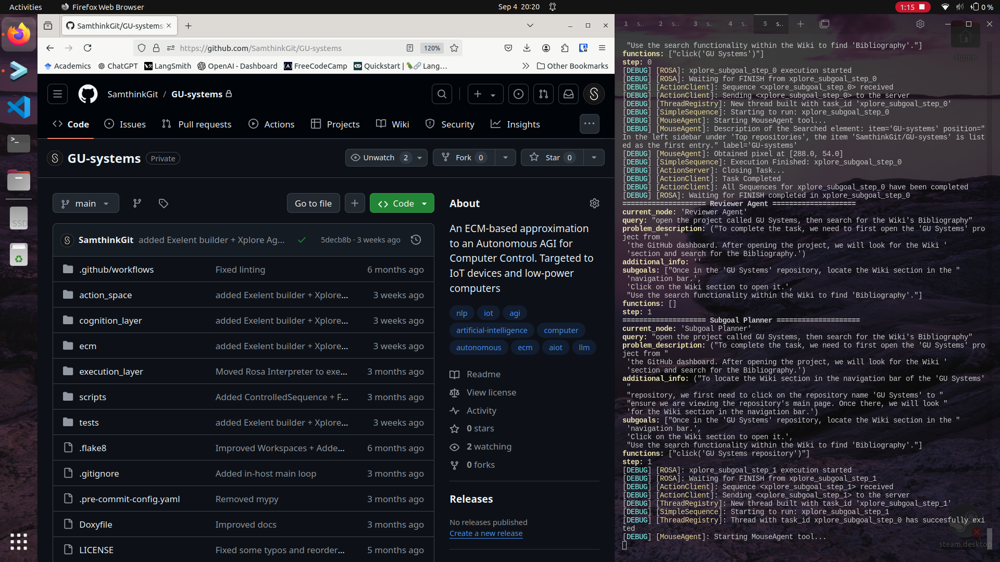
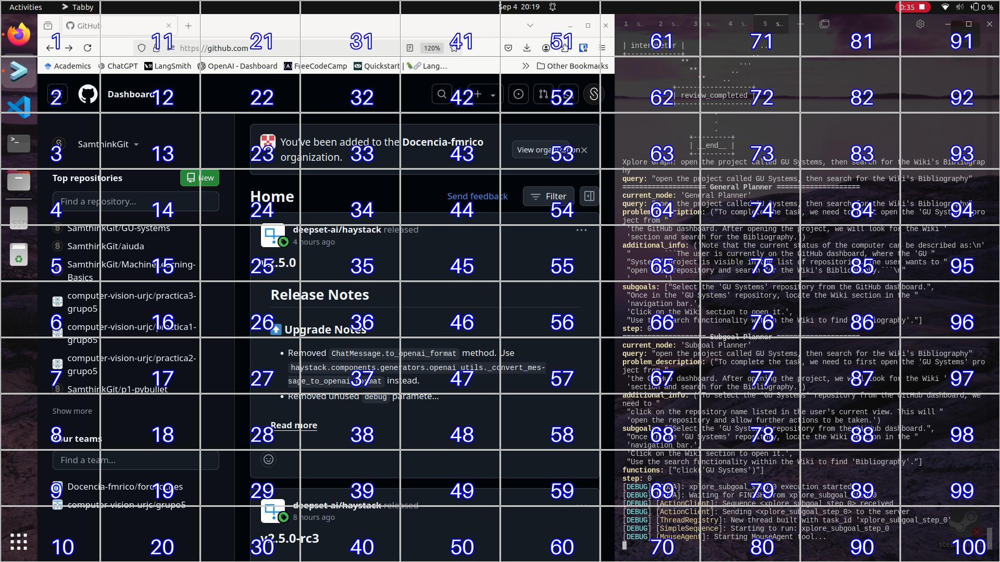

# Grid Mouse

## Summary
The Grid Mouse action space tries to cover the control of the mouse by using AI petitions to find the correct pixel into the screen. For normal precission 2 iterations is recommended, however 1 iteration can be used to find big elements.

## Actions & Utils

- `move_mouse_to`: Moves the mouse to a given location (px coord)
- `send_click_event`: Sends a left click signal through uinput
- `click`: Uses GridAgent to click into a described element on the screen.

## Dependencies

- **experimental.screenshot**

## Insights

Grid Mouse uses the screenshot tool to take a screenshot of the current display. The received image can be something as:

    

This image can be processed with the `Grid` class, which is responsible of generating/drawing a visual Grid and enabling an easy interface to calculate coordinates into each cell.

The generated grid would look like:

    

Each cell can be accessed as a `Cell` object, containing a `.absolute()` method in order to obtain absolute coords from the image.

Finally the MouseAgent is an LLM-based agent that iterates through the Grid images, providing the number correspondent to the cell which contains the target element, until it finds the position of  the element, returning the pixel coords.

This coords will be sent as an event in order to click on the described element.
