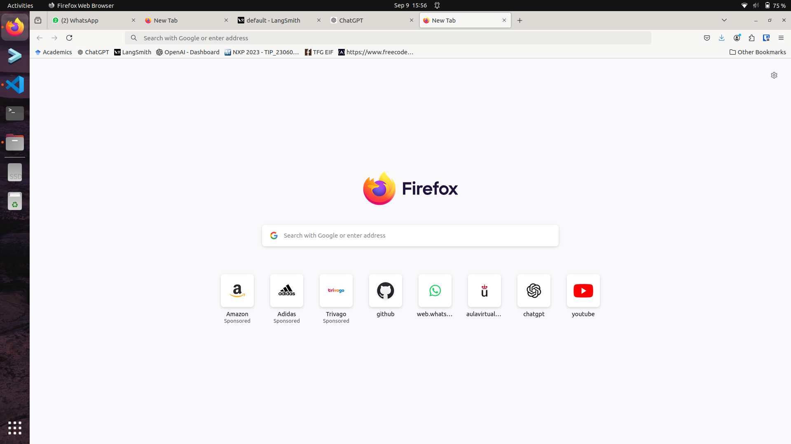

# Screenshot

## Summary

The screenshot tool is a set of utils to take a screenshot in different OS. So far, it is tested on Raspbian and Ubuntu-22;

## Actions and Utils

`screenshot`: Takes an screenshot and returns a PIL.Image

## Dependencies

- Grim (Raspbian)
- pyautogui (Ubuntu-22)

## Insights
For taking screenshots it will load grim if the OS is Raspbian, else will use pyautogui.

The outcome would be an image like:

    

